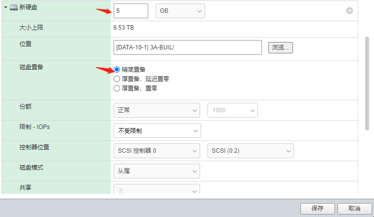

public:: true

- [为ESXI主机上的虚拟机挂载新硬盘](https://leiblog.wang/%E4%B8%BAESXI%E4%B8%BB%E6%9C%BA%E4%B8%8A%E7%9A%84%E8%99%9A%E6%8B%9F%E6%9C%BA%E6%8C%82%E8%BD%BD%E6%96%B0%E7%A1%AC%E7%9B%98/)
- > 大部分参考了上面文章中的内容
- 下面以我们当前测试环境部署的Esxi及CentOS7服务器为例,进行演示
- ## 网页端操作
	- 登录Esxi服务器,选中我们需要挂载新硬盘的服务器,并点击**编辑**
	- 
	- 弹出的编辑窗口中选择**添加硬盘**,然后选择**新标准硬盘**
	- 
	- 填写新**硬盘大小**,磁盘置备选择**精简置备**后点击**保存**
	- 
	- 保存后,我们可以在硬件配置中看到此新增的硬盘
	- 
-
- ## 服务器端操作
	- 使用xshell登录服务器,并切换到root用户
	- 使用`df -Th`命令可以查看我们当前磁盘挂载,磁盘格式及各分区使用情况等信息
	- 从图中可以看到,我们挂载的硬盘格式为xfs,所以待会我们新挂载的时候也使用xfs格式进行挂载
	- 
	- 使用`fdisk -l`可以看到我们添加的所有硬盘,根据大小我们可以看到新加的硬盘为`/dev/sdc`
	- 
	- 找到新加硬盘后,我们需要先对硬盘进行格式化,并指定类型,上一步我们已经知道需要将硬盘格式化为xfs格式
	- 执行`mkfs -t xfs /dev/sdc`
	- {:height 215, :width 683}
	- 格式化后,此硬盘就可以用于挂载了,接下来我们创建需要挂载的路径,比如`/data1`
	- `mkdir /data1`
	- 
	- 创建成功后,将`/dev/sdc`挂载至`/data1`
	- `mount -t xfs /dev/sdc /data1`
	- 
	- 从上图可以看到,硬盘已成功挂载至`/data1`下
	- 接下来,我们需要为其配置上开机自动挂载,否则重启后还需要自己手动再次挂载
	- 修改`/etc/fstab`文件,添加一行内容如下
	- 
	- 前面3项分别对应硬盘名称,挂载路径以及硬盘格式类型,按照我们的实际情况填写即可,后面的按上面默认格式填写即可,填写完成后保存退出
	- 测试重启服务器,硬盘正常自动挂载