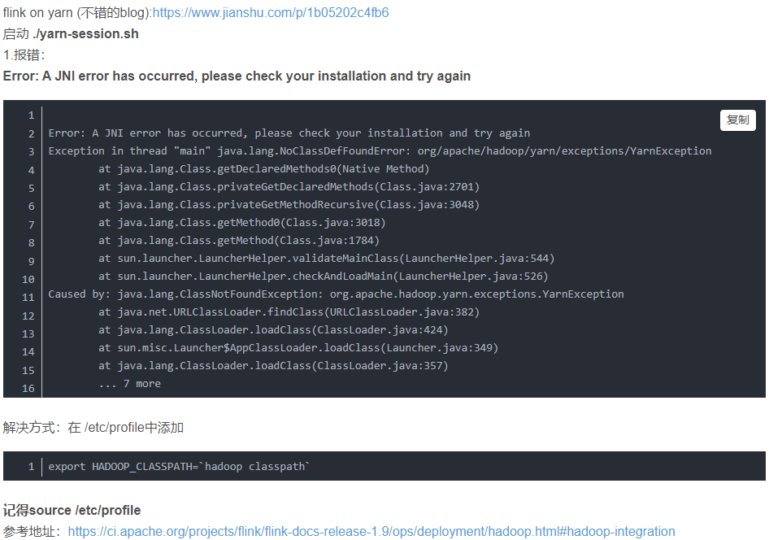

public:: true

- [Centos 7 环境 hadoop 3.2.1分布式集群搭建](https://www.modb.pro/db/46147)
- [Centos7环境下Kafka的安装(单机版)](https://ivanzz1001.github.io/records/post/mq/2018/05/16/mq-kafka-install)
-
- ## 部署模式
	- 会话模式
		- ((62450ce5-4bd3-430d-ad09-3c77d87ceace))
	- 单作业模式
		- ((62450cfa-2832-4b40-b6f9-7b46e358410e))
		- 作业和集群一对一
	- 应用模式
		- ((62450d13-0ed7-4469-962b-e908d22704a6))
		- 应用和集群一对一
	- ((62450d33-59e4-48c0-ad47-02c1bc2cd5f3))
-
- ## YARN模式
	- ((62450dec-7154-4f5d-819e-fc4150cff13e))
	- 
	-