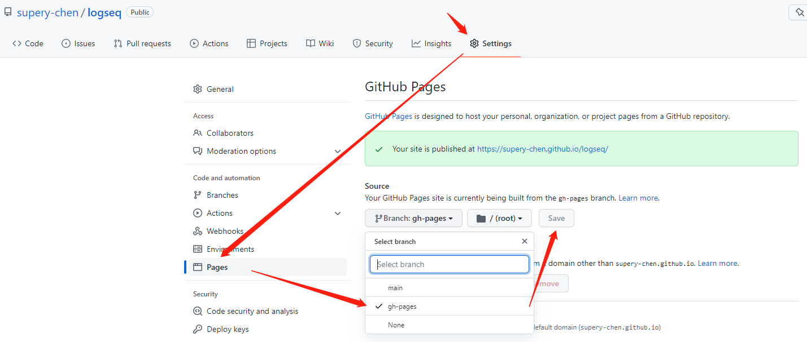

public:: true

- ## 原理说明
	- logseq本身支持发布为静态页面，所以可以很方便的发布至Github Pages，所以我们要做的就是通过[pengx17/logseq-publish](https://github.com/pengx17/logseq-publish)以及[JamesIves/github-pages-deploy-action](https://github.com/JamesIves/github-pages-deploy-action)结合`Github Actions`来自动化实现这一个步骤
- ## 前置条件
	- 创建[[Github Pages]]
- ## 编写`Github Action`
	- 创建[[action.yaml]]
	- 创建[[main.yaml]]
- ## 配置Github Pages
	- > 首次可能还未创建`gh-pages`，可以手动触发一次`main.yaml`，然后再进行此配置
	- 
-
- 上述配置完成后，即可访问[Github Pages](https://supery-chen.github.io/logseq/#/)