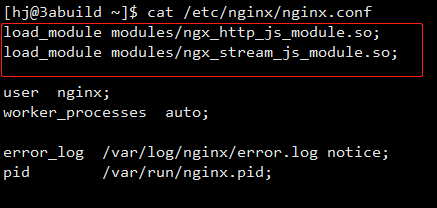

public:: true

- #nginx #tcp #http #proxy
- > 原理:借助nginx提供的[njs](https://nginx.org/en/docs/njs/install.html)模块,分析数据包格式,判断是否为http数据包,如果满足,则转发至后端http服务进行处理,否则转发至后端tcp服务
- **Nginx的安装比较简单,网上文档很多,这里就不再说明,主要讲解njs模块的安装与使用**
-
- ## [njs](https://nginx.org/en/docs/njs/)
	- > njs is a subset of the JavaScript language that allows extending nginx functionality. njs is created in compliance with ECMAScript 5.1 (strict mode) with some ECMAScript 6 and later extensions. The compliance is still evolving.
	  从[nginx官方文档介绍](https://nginx.org/en/docs/njs/)可以看到,njs是nginx提供的一个JavaScript的子集,方便我们使用js编写代码来扩展nginx功能
	- ### 安装
		- 本次使用的服务器为`CentOS 7`, `nginx`版本为`1.20.2`
		- 根据`nginx`安装方式不同,`njs`需要使用相同的安装方式
		- #### [包管理工具安装](https://nginx.org/en/docs/njs/install.html#install_package)
		  collapsed:: true
			- 1. 安装前先执行以下命令:
				- ```shell
				  sudo yum install yum-utils
				  ```
			- 2. 设置`yum`存储库,创建`/etc/yum.repos.d/nginx.repo`并填写如下内容:
				- ```
				  [nginx-stable]
				  name=nginx stable repo
				  baseurl=http://nginx.org/packages/centos/$releasever/$basearch/
				  gpgcheck=1
				  enabled=1
				  gpgkey=https://nginx.org/keys/nginx_signing.key
				  module_hotfixes=true
				  
				  [nginx-mainline]
				  name=nginx mainline repo
				  baseurl=http://nginx.org/packages/mainline/centos/$releasever/$basearch/
				  gpgcheck=1
				  enabled=0
				  gpgkey=https://nginx.org/keys/nginx_signing.key
				  module_hotfixes=true
				  ```
			- 3. 执行以下命令进行安装:
				- ```shell
				  sudo yum -y install nginx-module-njs
				  ```
			- 4. 安装完成后,需要修改nginx.conf,在顶部声明加载对应模块
				- ```conf
				  load_module modules/ngx_stream_js_module.so;
				  load_module modules/ngx_http_js_module.so;
				  ```
				- 
				-
		- #### [编译安装](https://nginx.org/en/docs/njs/install.html#install_sources)
			- 1. 首先安装`Mercurial client`,需要借助其克隆njs的源码
				- ```shell
				  sudo yum -y install mercurial
				  ```
			- 2. 克隆`njs`源码,执行下面的命令会下载`njs`源码到当前路径下的`njs`目录
				- ```shell
				  hg clone http://hg.nginx.org/njs
				  ```
			- 3. 重新编译安装`nginx`(增加`njs`模块)
				- 到之前编译`nginx`的路径下,重新执行编译命令(在命令最后增加`--add-module=njs下载路径/nginx`)
				- 假设原先的`nginx`编译命令如下:
					- `./configure --with-http_ssl_module --with-http_stub_status_module --with-http_gzip_static_module --with-pcre --with-stream`
				- `njs`下载路径为`/home/hj/njs`
				- 则新的编译命令如下:
					- `./configure --with-http_ssl_module --with-http_stub_status_module --with-http_gzip_static_module --with-pcre --with-stream --add-module=/home/hj/njs/nginx`
					-
	- ### 脚本编写
		- 按上述任一方式安装`njs`完成后,下一步进行`js`脚本的编写,此处可以参考[github](https://github.com/nginx/njs-examples#choosing-upstream-in-stream-based-on-the-underlying-protocol-stream-detect-http)的官方示例.脚本编写完成后,我们将其存放至`path-to-nginx/njs/detect_http.js`
			- ```js
			  var is_http = 0;
			  
			  function detect_http(s) {
			      s.on('upload', function (data, flags) {
			          var n = data.indexOf('\r\n');
			        	//判断数据包格式,如果格式满足http协议,则is_http为真,否则为假
			          if (n != -1 && data.substr(0, n - 1).endsWith(" HTTP/1.")) {
			              is_http = 1;
			          }
			  		
			          if (data.length || flags.last) {
			              s.done();
			          }
			      });
			  }
			  
			  function upstream_type(s) {
			    	//如果是http协议,则返回httpback,否则返回tcpback
			      return is_http ? "httpback" : "tcpback";
			  }
			  
			  //暴露出这两个方法,供nginx使用
			  export default {detect_http, upstream_type}
			  ```
				-
	- ### 配置
		- 脚本编写完成后,下一步我们需要在`nginx.conf`中进行配置以使用.在`nginx.conf`中追加如下配置
			- ```conf
			  stream {
			      # 配置njs脚本所在目录
			      js_path "/path-to-nginx/njs/";
			      # 引入刚才编写的脚本detect_http.js
			      js_import main from detect_http.js;
			      # 设置upstream的值为upstream_type方法的返回值
			      js_set $upstream main.upstream_type;
			  
			  	# 定义名称为httpback的upstream,指定内部server指向我们的http服务
			      # 注意这里的httpback需要与脚本中的upstream_type方法返回字符串一致
			      upstream httpback {
			      	# 这是测试用的http服务地址
			          server 127.0.0.1:8001;
			      }
			  	# 定义名称为tcpback的upstream,指定内部server指向我们的tcp服务
			      # 注意这里的tcpback需要与脚本中的upstream_type方法返回字符串一致
			      upstream tcpback {
			      	# 这是测试用的tcp服务地址
			          server 127.0.0.1:8002;
			      }
			  	# 定义server
			      server {
			      	# 指定监听端口
			          listen 8000;
			          # 在预读阶段调用detect_http方法
			          js_preread  main.detect_http;
			          # 根据detect_http执行结果代理请求至tcpback或httpback
			          proxy_pass $upstream;
			      }
			  }
			  ```
		- 关于`njs`模块的更多的用法可以参考[官方文档](https://nginx.org/en/docs/njs/)
		- 上述配置完成后,执行`nginx -s reload`使配置生效
		-
	- ### 测试
		- 为了进行测试,我用python脚本分别编写了一个http服务与tcp服务,分别监听8001与8002端口,并提供了请求的echo功能
		- 此时分别使用http与tcp请求nginx服务器的8000端口进行测试,结果如下
		- 
		- 
		-
		-
- ## 参考文档
	- [choosing-upstream-in-stream-based-on-the-underlying-protocol-stream-detect-http](https://github.com/nginx/njs-examples#choosing-upstream-in-stream-based-on-the-underlying-protocol-stream-detect-http)