- #image-uploader
- query-table:: true
  #+BEGIN_QUERY
  {:title "Not uploaded images"
    :query [:find (pull ?b [*])
          :where
          [?b :block/page ?p]
          [?p :block/name ?page_name]
          (not [(clojure.string/includes? ?page_name "created by logseq-plugin-image-uploader")])
          [?b :block/content ?content]
          (not [(clojure.string/includes? ?content "{:title \"Not uploaded images\"")])
          [(clojure.string/includes? ?content "](../assets")]
          [(clojure.string/includes? ?content "![")]
          (or [(clojure.string/includes? ?content ".png)")]
              [(clojure.string/includes? ?content ".jpg)")]
              [(clojure.string/includes? ?content ".jpeg)")]
              [(clojure.string/includes? ?content ".gif)")]
              [(clojure.string/includes? ?content ".tiff)")]
              [(clojure.string/includes? ?content ".tif)")]
              [(clojure.string/includes? ?content ".bmp)")]
              [(clojure.string/includes? ?content ".svg)")]
              [(clojure.string/includes? ?content ".webp)")]
              [(clojure.string/includes? ?content ".PNG)")]
              [(clojure.string/includes? ?content ".JPG)")]
              [(clojure.string/includes? ?content ".JPEG)")]
              [(clojure.string/includes? ?content ".GIF)")]
              [(clojure.string/includes? ?content ".TIGG)")]
              [(clojure.string/includes? ?content ".TIF)")]
              [(clojure.string/includes? ?content ".VMP)")]
              [(clojure.string/includes? ?content ".SVG)")]
              [(clojure.string/includes? ?content ".WEBP)")])
        ]}
  #+END_QUERY
- ../assets/image_1643073454713_0.png
- ../assets/image_1642749583413_0.png
- ../assets/image_1642749901268_0.png
- ../assets/image_1642750072358_0.png
- ../assets/image_1642751090659_0.png
- ../assets/image_1642760131296_0.png
- ../assets/image_1642760499027_0.png
- ../assets/image_1642760735399_0.png
- ../assets/image_1642761268483_0.png
- ../assets/image_1643018276652_0.png
- ../assets/image_1642490318088_0.png
- ../assets/image_1642756857560_0.png
- ../assets/image_1642578394869_0.png
- ../assets/image_1642578662404_0.png
- ../assets/image_1642579019847_0.png
- ../assets/image_1642579057268_0.png
- ../assets/image_1642579460111_0.png
- ../assets/image_1642579591670_0.png
- ../assets/image_1642579693892_0.png
- ../assets/未命名文件_1643104728464_0.png
- ../assets/image_1643249429238_0.png
- ../assets/image_1643249579582_0.png
- ../assets/image_1643249595934_0.png
- ../assets/image_1643273543725_0.png
- ../assets/image_1644811111407_0.png
- ../assets/image_1644823579371_0.png
- ../assets/image_1644823644880_0.png
- ../assets/image_1644823836457_0.png
- ../assets/image_1644845681167_0.png
- ../assets/image_1644845953936_0.png
- ../assets/image_1644846129377_0.png
- ../assets/image_1644907235449_0.png
- ../assets/image_1644907880328_0.png
- ../assets/image_1645433122036_0.png
- ../assets/image_1645433167024_0.png
- ../assets/image_1645494302325_0.png
- 
- 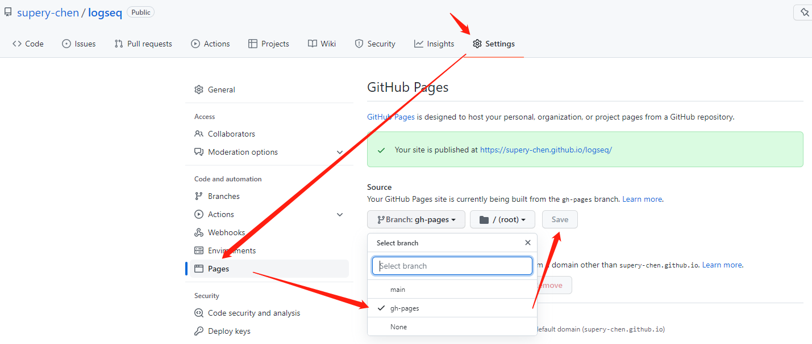
- 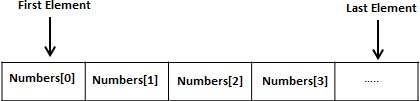
- 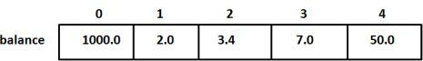
- 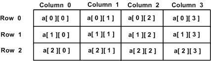
- 
- 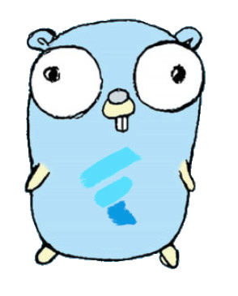
- 
- 
- 
- 
- 
- 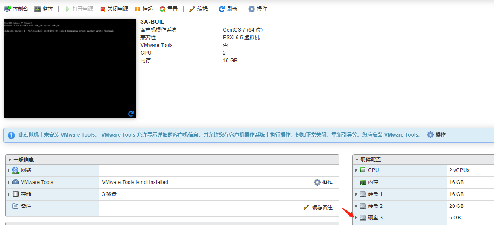
- 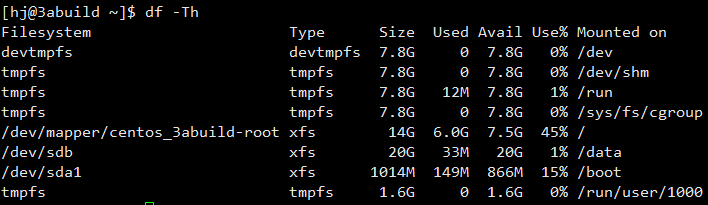
- 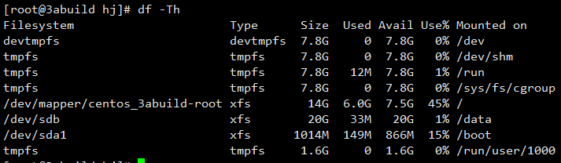
- 
- 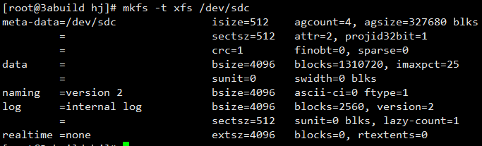
- 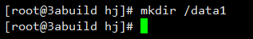
- 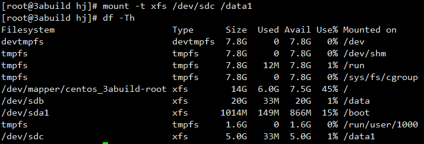
- 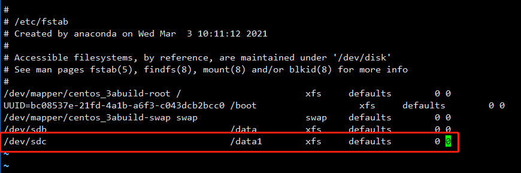
- 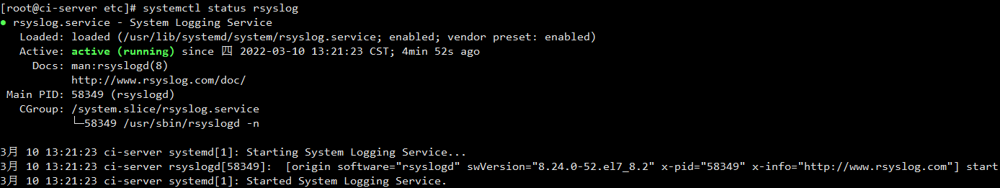
- 
- 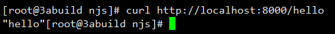
- 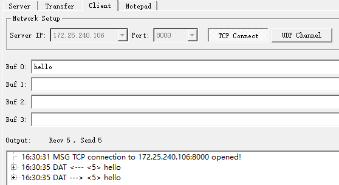
- 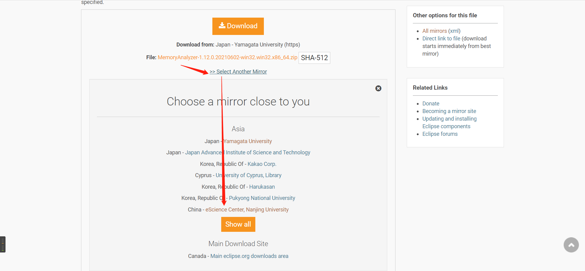
- 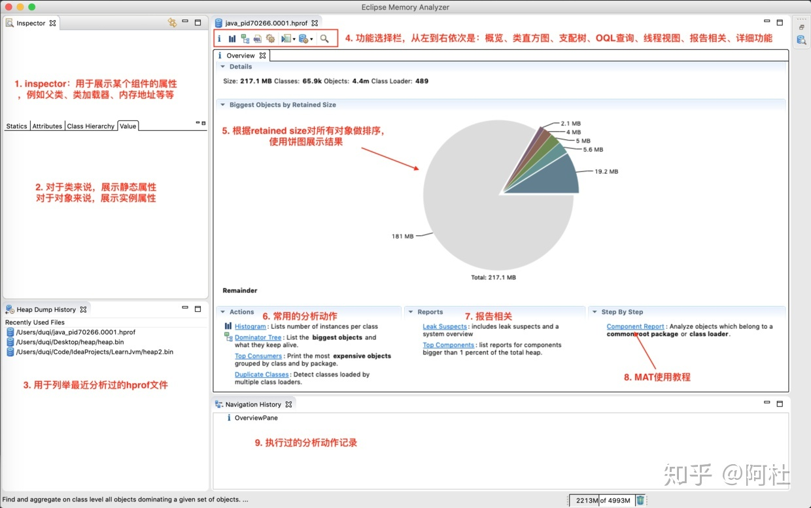
- 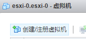
- 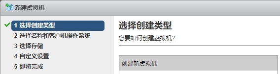
- 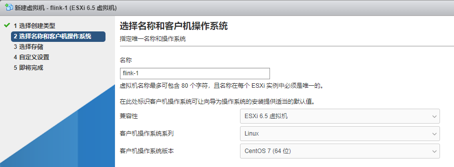
- 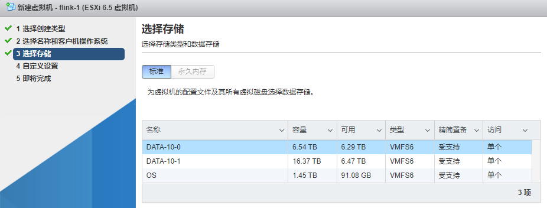
- 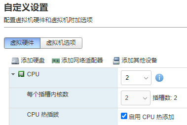
- 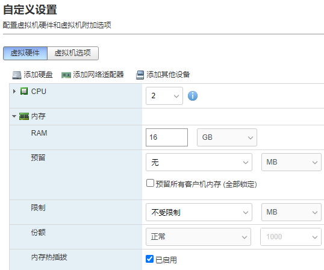
- 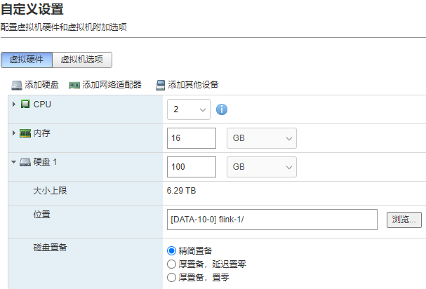
- 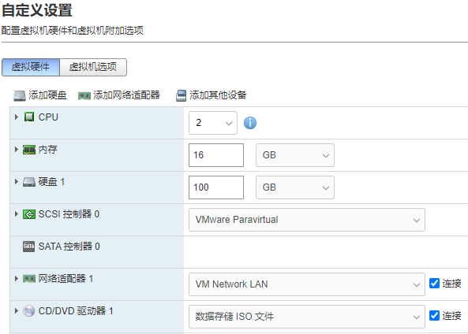
- 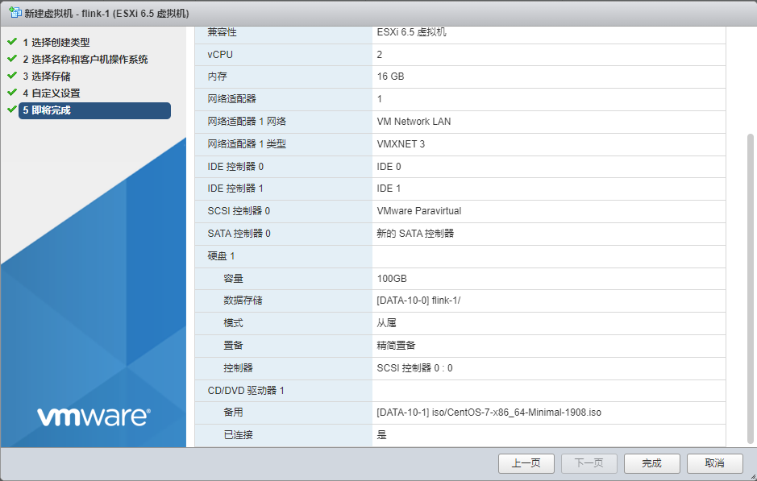
- 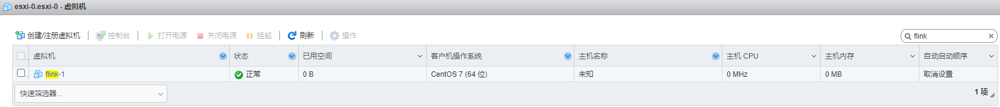
- 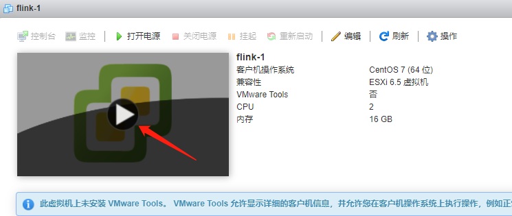
- 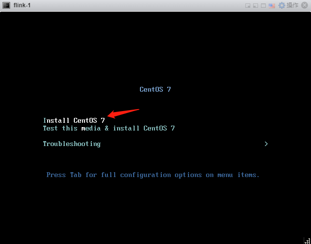
- 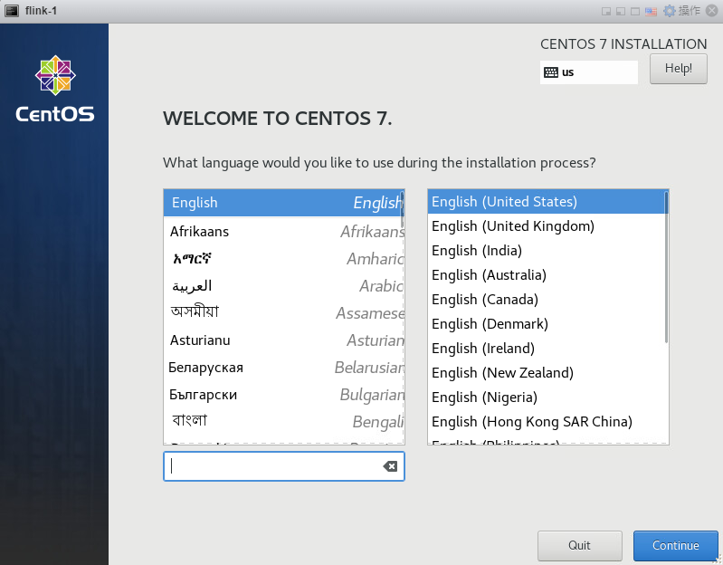
- 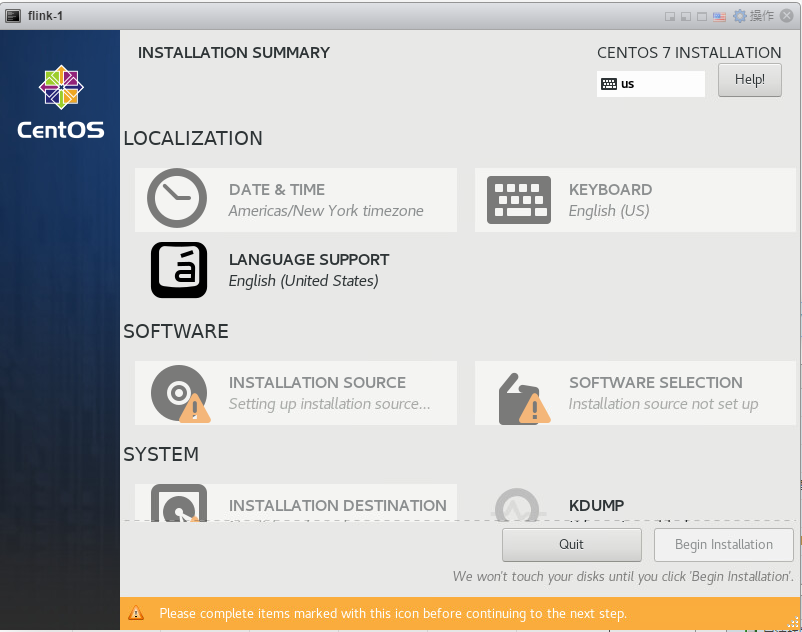
- 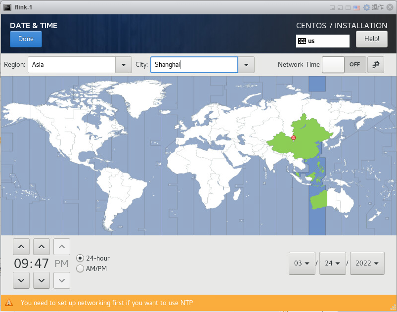
- 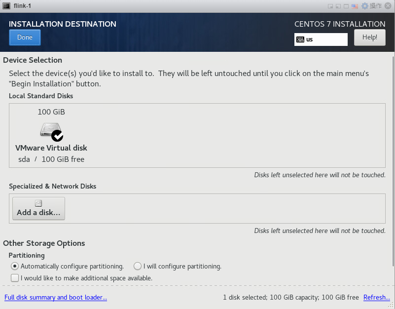
- 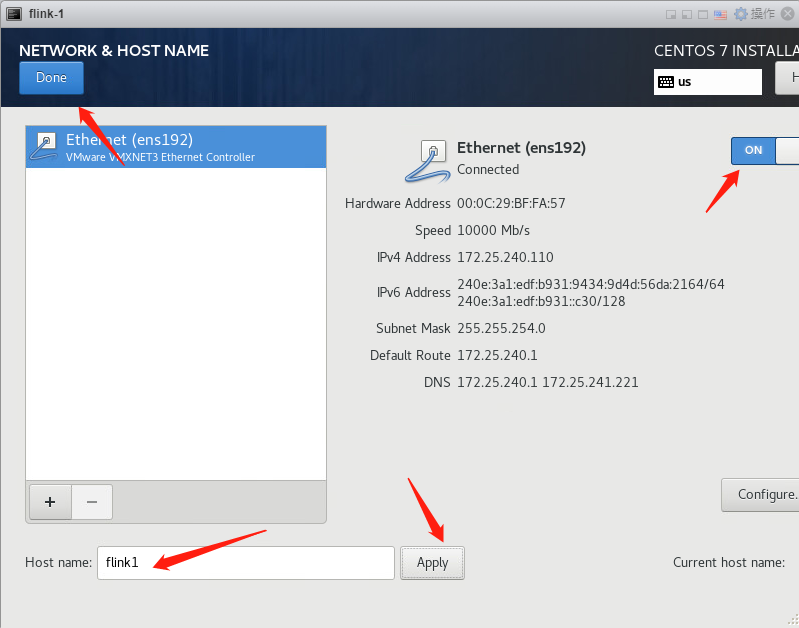
- 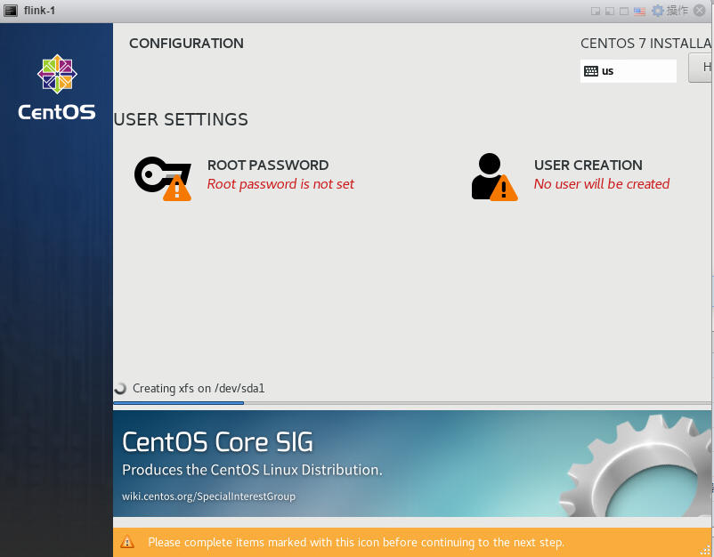
- 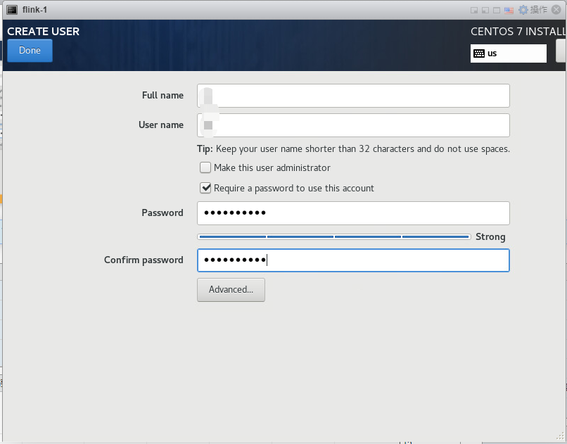