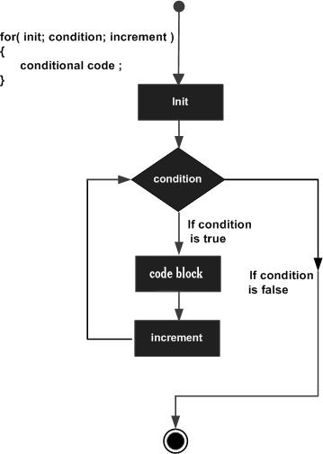

- ## 语法
	- Go语言的for循环有3种形式，只有其中一种使用分号
	- 和C语言种的for循环一样
		- ```go
		  for init; condition; post {}
		  ```
	- 和C的while一样
		- ```go
		  for condition {}
		  ```
	- 和C的for(;;)一样
		- ```go
		  for {}
		  ```
	- init：一般为赋值表达式，给控制变量赋初值
	- condition：关系表达式或逻辑表达式，循环控制条件
	- post：一般为赋值表达式，给控制变量增量或减量
	- for语句执行过程如下
		- 先对表达式1赋初值
		- 判别赋值表达式init是否满足给定条件，若其值为真，满足循环条件，则执行循环体内语句，然后执行post，进入第二次循环，再判别condition；否则判断condition的值为假，不满足条件，就终止for循环，执行循环体外语句
	- for循环的range格式可以对slice、map、数组、字符串等进行迭代循环
		- ```go
		  for key, value := range oldMap {
		    newMap[key] = value
		  }
		  ```
	- for语句语法流程如下图所示
		- 
- ## 实例
	- ```go
	  package main
	  
	  import "fmt"
	  
	  func main() {
	  	var b int = 15
	  	var a int
	  
	  	numbers := [6]int{1, 2, 3, 5}
	  
	  	for a := 0; a < 10; a++ {
	  		fmt.Printf("a 的值为: %d\n", a)
	  	}
	  
	  	for a < b {
	  		a++
	  		fmt.Printf("a 的值为: %d\n", a)
	  	}
	  
	  	for i, x := range numbers {
	  		fmt.Printf("第 %d 位 x 的值 = %d\n", i, x)
	  	}
	  }
	  ```