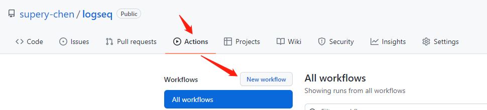
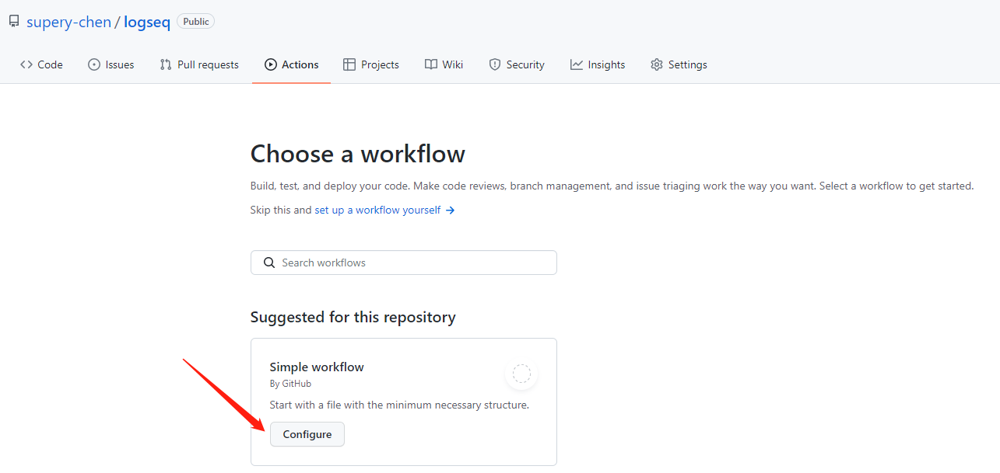

public:: true
title:: main.yaml

- 在`supery-chen/logseq`库中点击[actions](https://github.com/supery-chen/logseq/actions)按钮，再点击`New workflow`，创建一个工作流
- 
- 选择`Simple workflow`进行创建
- 
- 输入名称为`main.yaml`，内容如下
- ```yaml
  name: CI
  
  on:
    push:
      branches: [ main ]
    workflow_dispatch:
    repository_dispatch:
  
  jobs:
    build:
      runs-on: ubuntu-latest
      steps:
        - uses: actions/checkout@v2
  
        - name: Logseq Publish 🚩
        	# 其它地方不需要变更，修改此处为logseq对应的库即可
          uses: supery-chen/logseq@main
  
        - name: add a nojekyll file
          run: touch $GITHUB_WORKSPACE/www/.nojekyll
  
        - name: Deploy 🚀
          uses: JamesIves/github-pages-deploy-action@v4
          with:
            branch: gh-pages
            folder: www
            clean: true
            single-commit: true
  ```