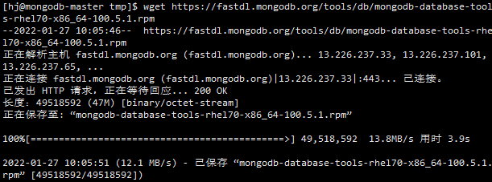

- MongoDB的数据导出，官方提供了[mongoexporter](https://docs.mongodb.com/database-tools/mongoexport/)命令行工具，该工具在MongoDB4.4版本及以后，已包含在mongodb-database-tools包中单独进行版本控制，所以需要单独[安装](https://docs.mongodb.com/database-tools/installation/installation-linux/)
- ## mongodb-database-tools安装
	- 在[下载页面](https://www.mongodb.com/try/download/database-tools?tck=docs_databasetools)下载CentOS 7.0对应的rpm安装包连接，使用wget下载到服务器
		- 
	-
	-
-