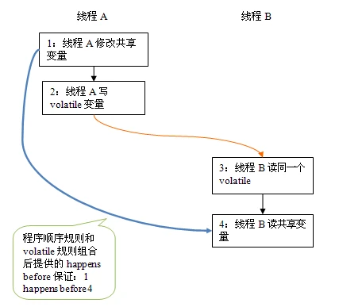
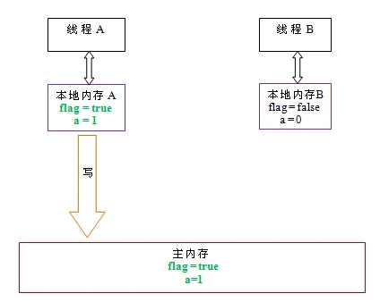

- ## volatile的特性
- 当我们声明共享变量为volatile后，对这个变量的读写将会很特别
- 理解volatile特性的一个好方法是：把对volatile变量的单个读写看成是使用同一个监视器锁对单个读写操作做了同步
- ```java
  public class VolatileFeaturesExample {
      volatile long v1 = 0L; //使用volatile声明一个64位long类型的变量
      public void set(long l) {
          v1 = l; //单个volatile变量的写
      }
      public void increment() {
          v1++; //复合(多个)volatile变量的读写
      }
      public long get() {
          return v1; //单个volatile变量的读
      }
  }
  ```
- 假设多个线程分别调用上面程序的三个方法，这个程序在语义上和下面程序等价
- ```java
  public class VolatileFeaturesExample {
      long v1 = 0L; //声明一个64位long类型的普通变量
      public synchronized void set(long l) {
          v1 = l; //对单个普通的变量的写使用一个同步监视器同步
      }
  
      public void increment() {//普通方法调用
          long temp = get();   //调用同步的读方法
          temp += 1;           //普通写
          set(temp);           //调用同步的写方法
      }
  
      public synchronized long get() {
          return v1; //对单个普通变量的读使用一个同步监视器同步
      }
  }
  ```
- 如上面示例程序所示，对一个volatile变量的单个读写操作，与对一个普通变量读写操作使用同一个监视器锁来同步，效果是一样的
- 监视器锁的happens-before规则保证释放监视器和获取监视器的两个线程之间的内存可见性，这意味着对一个volatile变量的读，总能看到(任意线程)对这个volatile变量最后的写入
- 监视器锁的语义决定了临界代码的执行具有原子性。这意味着即使是64位的long型和double型变量，只要它是volatile变量，对该变量的读写就将具有原子性。而如果是多个volatile操作或类似于volatile++这种复合操作，这些操作整体上不具有原子性
- 简而言之，volatile变量自身具有下列特性：
- - 可见性：对一个volatile变量的读，总能看到(任意线程)对这个volatile变量最后的写入
- - 原子性：对任意单个volatile变量的读写具有原子性，但类似volatile++这种复合操作则不具有原子性
-
- ## volatile写 - 读建立的happens-before关系
- 上面讲的是volatile变量自身的特性，对于程序员来说，volatile对线程的内存可见性的影响比volatile自身的特性更重要，也更需要我们去关注
- 从JSR-133开始，volatile变量的写-读可以实现线程间通信
- 从内存语义的角度来讲，volatile与监视器锁有相同效果：volatile写和监视器的释放有相同的内存语义；volatile读与监视器的获取有相同语义
- 请看下面使用volatile变量的示例代码
- ```java
  public class VolatileExample {
      int a = 0;
      volatile boolean flag = false;
  
      public void writer() {
          a = 1;              //1
          flag = true;        //2
      }
  
      public void reader() {
          if (flag) {         //3
              int i = a;      //4
              //...
          }
      }
  }
  ```
- 假设线程A执行writer()方法之后，线程B执行reader()方法。根据happens-before规则，这个过程建立的happens-before关系可以分为两类
- 1. 根据程序次序规则，1 happens-before 2；3 happens-before 4
  2. 根据volatile规则，2 happens-before 3
  3. 根据happens-before的传递性规则，1 happens-before 4
- 上述happens-before关系的图形化表现形式如下：
- 
- 在上图中，每一个箭头链接的两个节点，代表一个happens-before关系。黑色箭头表示程序顺序规则；橙色箭头表示volatile规则；蓝色箭头表示组合这些规则后提供的happens-before保证
- 这里A线程写了一个volatile变量后，B线程读同一个volatile变量。A线程在写volatile变量之前所有可见的共享变量，在B线程读同一个volatile变量后，将立即变得对B线程可见
-
- ## volatile写 - 读的内存语义
- **volatile写**的内存语义如下：
- - 当写一个volatile变量时，JMM会把该线程对于的本地内存中的共享变量刷新到主内存
- 以上面示例程序VolatileExample为例，假设线程A首先执行writer()方法，随后线程B执行reader()方法，初始时两个线程的本地内存中flag和a都是初始状态。下图时线程A执行volatile写后，共享变量的状态示意图：
- 
- 如上图所示，线程A在写flag变量后，本地内存A中倍线程A更新过的两个共享变量值被刷新导主内存中。此时本地内存A与主内存中的共享变量值一致
- **volatile读**的语义如下：
- - 当读一个volatile变量时，JMM会把该线程对于的本地内存置为无效。线程接下来