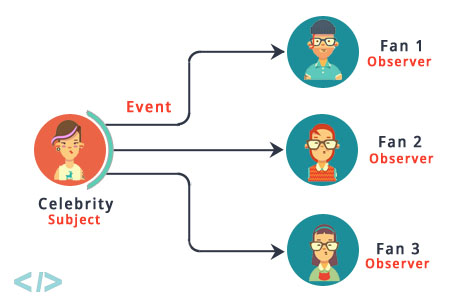

- ## 响应式编程
- 本质上是一个`观察者模式`
- 
- ## 官方示例
- ```java
  userService.getFavorites(userId) ➊
             .flatMap(favoriteService::getDetails)  ➋
             .switchIfEmpty(suggestionService.getSuggestions())  ➌
             .take(5)  ➍
             .publishOn(UiUtils.uiThreadScheduler())  ➎
             .subscribe(uiList::show, UiUtils::errorPopup);  ➏
  ```
- ➊ 根据用户ID查询喜欢的信息(打开一个Publisher)
- ➋ 使用flatMap操作获取喜欢信息详情
- ➌ 使用switchIfEmpty，在喜欢信息为空的情况下填充推荐信息
- ➍ 取前5个
- ➎ 发布到UI线程
- ➏ 最终的消费行为
-
- 前4步的行为看起来类似Java8中的Stream编程，但这里的实现与Stream是不同的，后续会展开分析
- 后两步在我们之前的编码中没有遇到过类似的，这里的行为，我们可以在后续的[Reference#schedulers](http://projectreactor.io/docs/core/release/reference/#schedulers)中得知，`publishOn`将影响后续的行为操作所在的线程，对应的还有`subscribeOn`，这个函数仅影响`事件源`所在的线程
-
- ## SPI模型定义
- ### Publisher(发布者、被观察者)
- ```java
  package org.reactivestreams;
  public interface Publisher<T> {
      public void subscribe(Subscriber<? super T> s);
  }
  ```
-
-